# Kubernetes Lessons

Welcome! This repository contains step-by-step lessons for setting up and using Kubernetes locally.

## Navigation
 - [Kubernetes Local Setup (minikube with WSL) 🖥️](#kubernetes-local-setup)
 - [Pod 🧱](#pod)
 - [Service 🛰️](#service)
 - [Replicas 🧩](#replicas)
 - [Deployment 🚀](#deployment)
 - [Namespace 🗂️](#namespace)
 - [Configmap 🗄️](#configmap)
 - [Secret 🔐](#secret)
 - [Taints and Toleration ⚖️](#taints-and-toleration)
 - [Node Selector 🎯](#node-selector)
 - [Node Affinity 🧲](#node-affinity)
 - [Volumes 📦](#volumes)

<details id="kubernetes-local-setup">
<summary><strong>Kubernetes Local Setup (minikube with WSL)</strong></summary>

## Prerequisites

1. **Download Minikube**
   - [Minikube Releases](https://github.com/kubernetes/minikube/releases)
2. **Download kubectl**
   - [Install and Set Up kubectl on Windows](https://kubernetes.io/docs/tasks/tools/install-kubectl-windows/)
3. **Add to PATH**
   - Place both `minikube.exe` and `kubectl.exe` in a folder and add that folder to your system's environment variables (`PATH`).

## Setup Steps

4. **Verify Installation**
   Run the following commands in your terminal to verify installation:
   ```cmd
   kubectl.exe version --client
   minikube.exe version
   ```
5. **Start Docker Desktop**
   - Ensure Docker Desktop is running before starting Minikube.
6. **Start Minikube Cluster**
   ```cmd
   minikube.exe start
   minikube.exe status
   ```
   - The status should show:
     ```
     minikube
     type: Control Plane
     host: Running
     kubelet: Running
     apiserver: Running
     kubeconfig: Configured
     ```

> **Note:** Use the WSL terminal for Minikube and kubectl commands, and append `.exe` to each command on Windows.

7. **Fix Certificate Path Issues (if needed)**
   If you encounter certificate path issues, run:
   ```cmd
   minikube.exe delete
   minikube.exe start --driver=docker --embed-certs
   ```
   - After successful setup, you should see:
     *Done! kubectl is now configured to use "minikube" cluster and "default" namespace by default.*
   - Test with:
     ```cmd
     kubectl.exe get nodes
     ```
   - Example output:
     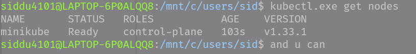

8. **Open Minikube Dashboard**
   ```cmd
   minikube.exe dashboard
   ```
   - This opens a browser tab with cluster metrics and info.
   - Example output:
     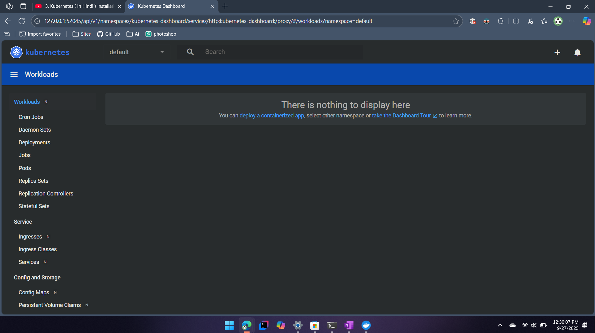

9. **SSH into Minikube VM**
   ```cmd
   minikube.exe ssh
   ```
   - Example output:
     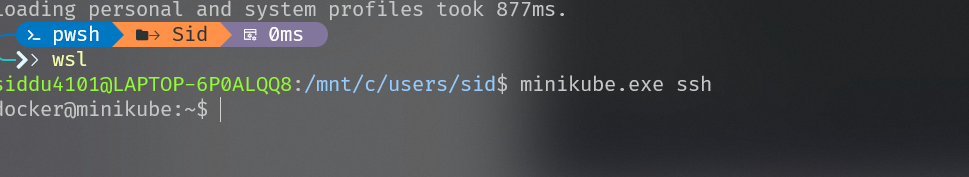

10. **Get Minikube Cluster IP**
    ```cmd
    minikube.exe ip
    ```
    - Example output:
      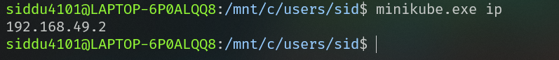

11. **Set Aliases in bashrc (Optional)**
    To avoid typing `.exe` every time, you can set aliases in your bashrc:
    1. Open your bashrc file:
       ```bash
       nano ~/.bashrc
       ```
    2. Add these lines at the end:
       ```bash
       alias minikube='minikube.exe'
       alias kubectl='kubectl.exe'
       ```
    3. Save and exit nano (Ctrl+O, Enter, Ctrl+X).
    4. Reload your bashrc to apply the aliases:
       ```bash
       source ~/.bashrc
       ```
    Now you can use `minikube` and `kubectl` commands without the `.exe` extension.

</details>

<details id="pod">
<summary><strong>Pod</strong></summary>

## 1. Creating a Simple Pod

Run the following command to create a pod:
```cmd
kubectl run my-first-pod --image=coolgourav147/nginx-custom
```
Check the pod status:
```cmd
kubectl get pods
```

> **Note:** To test a command without actually executing it, use the `--dry-run=client` option for client side response and for server side response you can use the `--dry-run=server`
```cmd
kubectl run --dry-run=client my-first-pod --image=coolgourav147/nginx-custom
```

- Example output:
  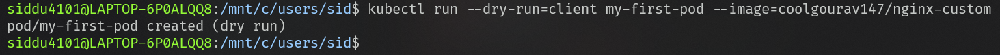

---

## 2. Get Resource List

You can get a list of resources using singular, plural, or short names:
```cmd
kubectl get pods
kubectl get pod
kubectl get po
```
All of the above provide the same result.

- Example output:
  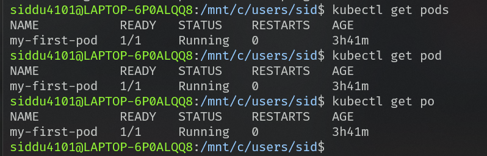

---

## 3. Get More Info About the Pod

```cmd
kubectl get pods -o wide
kubectl get pods -o yaml
kubectl get pods -o json
```

---

## 4. Get Documentation About Any Resource

```cmd
kubectl explain pods
kubectl explain nodes
```

---

## 5. Get Full Information About a Resource

```cmd
kubectl describe node minikube
kubectl describe pod my-first-pod
```

---

## 6. Watch Resource Status

To watch the status of a resource as it changes:
```cmd
kubectl get pods -w
```
> Example: If you remove the running container of your pod, this will watch for the state change. The container ID can be obtained from the describe command.

In the describe output, you can also check how many times the container has restarted (e.g., `Restart Count: 2` means it restarted twice).

Ex : I remove the running container of my pod so it watched for the state change
The container id I got from the describe command

- Example output:

  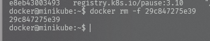
  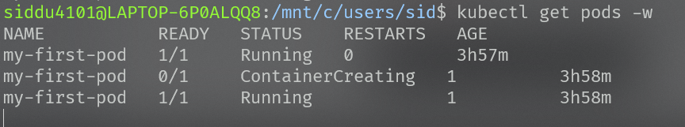
  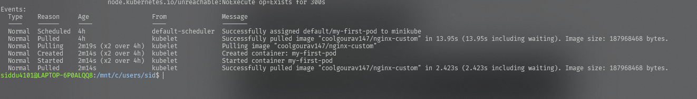

---

## 7. Delete Any Resource

```cmd
kubectl delete pod my-first-pod
```

- Example output:
  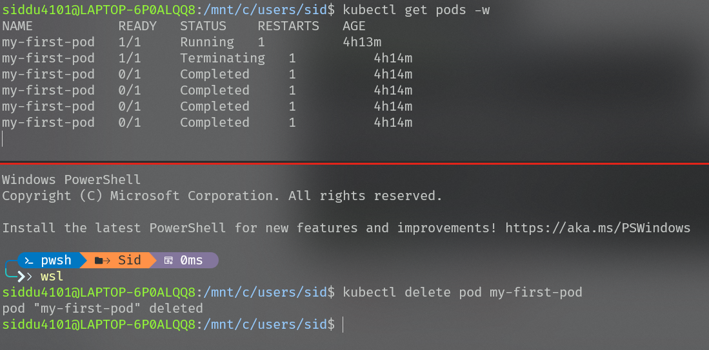

---

## 8. Attach, Update, or Remove Labels on Pods

Attach a label:
```cmd
kubectl label pod my-first-pod env=dev
```
- Example output:
  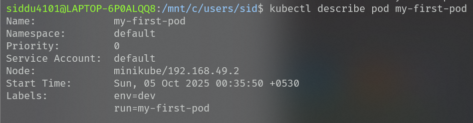

Get pods with a specific label:
```cmd
kubectl get pods -l env=dev
```
- Example output:
  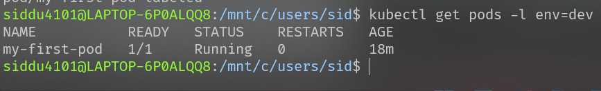

Update a label:
```cmd
kubectl label --overwrite pod my-first-pod env=prod
```
- Example output:
  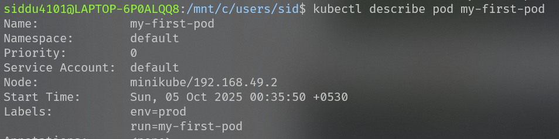

Remove a label:
```cmd
kubectl label pod my-first-pod env-
```
- Example output:
  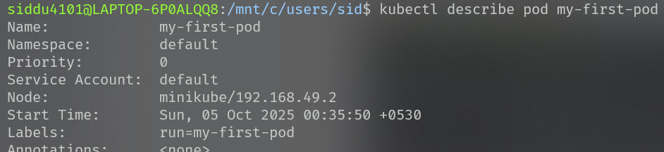

Add a label to all pods:
```cmd
kubectl label pod --all testKey=testValues
```
Add a label to selected pods:
```cmd
kubectl label pod my-first-pod my-second-pod testKey2=testValues2
```

---

## 9. Delete Pods

Delete specific pods:
```cmd
kubectl delete pod my-first-pod my-second-pod
```
Delete all pods in a namespace:
```cmd
kubectl delete pod --all
```

---

## 10. Create a Pod via YAML File

To learn about YAML fields for any resource, use
which will tell what all fields can be used for given resource in it's yaml
```cmd
kubectl explain pod
kubectl explain pod --recursive
kubectl explain pod.spec  # it gives more focused view of the spec field even u can go deep as possible to get more
```
If you need a sample YAML, generate one and edit as needed:
```cmd
kubectl run pod-created-by-output --image=coolgourav147/nginx-custom -o yaml --dry-run > pod-created-by-output.yaml
```
- Example output:
  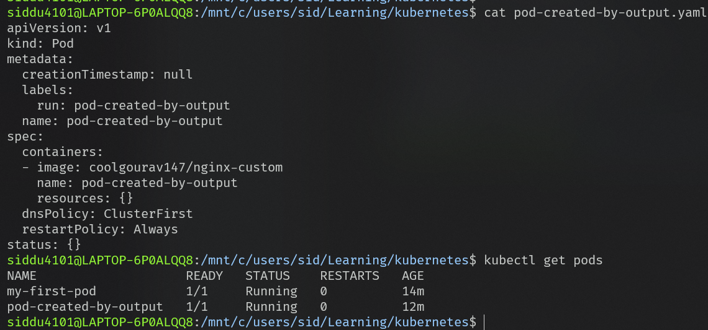

and I have created one simple required field yaml as below
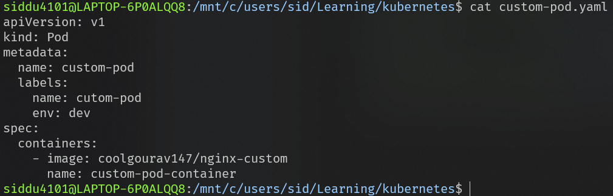

You can apply your custom YAML file in two ways:
```cmd
kubectl create -f custom-pod.yaml
kubectl apply -f custom-pod.yaml
```

---

## 11. How to Edit a Resource

You can edit a running resource like a pod (only metadata). If you want to update the spec (like image or anything else), do it via deployment or other controllers.

```cmd
kubectl edit pod custom-pod  # this opens a YAML you can edit; changes apply as soon as you close the editor
```

> **Note:** For pod metadata updates, no restart is required at the pod or container level. But if it's a deployment, the pod will be recreated with new specs/configs.

---

### Resource Creation: Imperative vs Declarative

There are two main ways to create or update resources in Kubernetes:

**a. Imperative Approach**
- You specify what to create or update directly via commands (e.g., run, create, delete for pods or deployments).
- Examples:
  ```cmd
  kubectl run pod test-custom-pod --image=coolgourav147/nginx-custom
  kubectl create deployment test-custom-deployment --image=coolgourav147/nginx-custom
  ```

**b. Declarative Approach**
- You define the desired state in a YAML file, and Kubernetes will ensure the cluster matches that state.
- Examples:
  ```cmd
  kubectl apply -f custom-pod.yaml
  kubectl create -f custom-pod.yaml
  ```

**Difference between `create` and `apply`:**
- `create` is used to create resources from scratch. If the resource already exists, it will throw an error.
- `apply` will merge changes if the resource exists, or create it if it does not.

---

## 12. Run a Pod with Environment Variables Inside the Container 🌱

You can run a pod that sets environment variables inside its container using a YAML file:

```cmd
kubectl apply -f pod-with-env-var.yaml
```

To view the environment variables inside the running pod, execute the following commands:

- For a single-container pod:
  ```cmd
  kubectl exec pod-with-env-var -- env
  ```
  - Example output:
    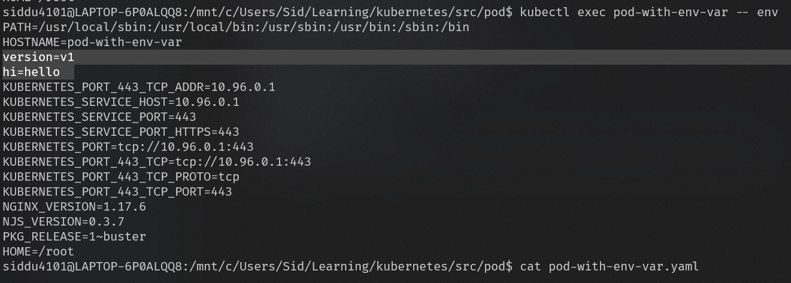
- For a multi-container pod (specify the container name):
  ```cmd
  kubectl exec pod-with-env-var -c container-with-env-var -- env
  ```

> **Tip:** If your pod has only one container, you don't need to specify the container name. For multi-container pods, always specify the container using `-c <container-name>`.

---

## 13. Customize Container Startup Commands ⚡

You can control what happens when your container starts by specifying commands and arguments in your Pod YAML:

- **ENTRYPOINT** in Docker maps to `command` in Kubernetes (the main executable to run)
- **CMD** in Docker maps to `args` in Kubernetes (the arguments for the command)

For example, to apply a pod with a custom command and arguments:

```cmd
kubectl apply -f pod-with-custom-command.yaml
```

- Example output:
  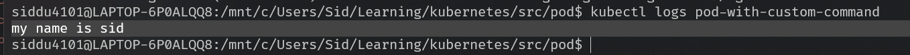

> 📝 **Tip:** Use `command` to override the default entrypoint, and `args` to provide arguments. This is useful for debugging or customizing container behavior at runtime.

---

## 14. Init Containers: Run Tasks Before Your App 🚦

Init containers let you run setup steps before your main application container starts. If you have multiple init containers, they run one after another. Only after all init containers finish successfully does your main app container start.

- Example: Run a pod with two init containers that each sleep for 10 seconds before starting the main container.

```cmd
kubectl apply -f pod-with-init-container.yaml
```

- Example output:  
  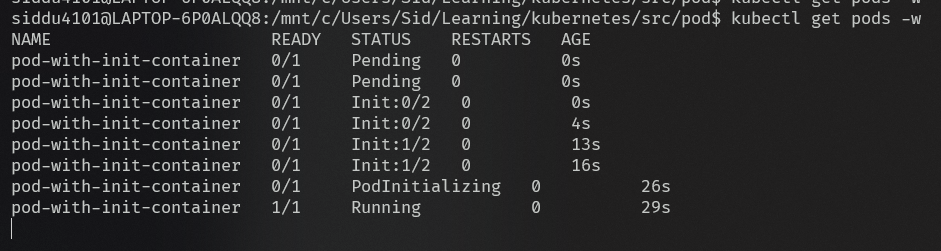

> 📝 **Tip:** Use init containers for setup tasks like waiting for a service, copying files, or running database migrations before your app starts.

</details>

<details id="service">
<summary><strong>Service</strong></summary>

## 1. What is a Service in Kubernetes? 🛰️

A **Service** in Kubernetes is an abstraction that provides a stable network endpoint (IP address and DNS name) for one or more pods. Services enable reliable communication between different parts of your application, even if pods are recreated or replaced.

There are four main types of Services:

- **ClusterIP**: Accessible only within the cluster (default type).
- **NodePort**: Exposes the service on each node’s IP at a static port, making it accessible outside the cluster.
- **LoadBalancer**: Provisions an external load balancer (if supported by your cloud provider) to route traffic to your service.
- **ExternalName**: Maps the service to an external DNS name instead of selecting pods.

> **Note:** Service forwards and load-balances requests only to pods whose `labels` match the Service's `spec.selector`.

---

## 2. ClusterIP Service 🔗

ClusterIP is the default service type that makes your application accessible only within the cluster. This is perfect for internal communication between pods.

### Step-by-Step Implementation:

#### a. Create and Test Backend Pod 🚀

First, let's create a simple backend application that returns text when accessed:

```cmd
kubectl apply -f backend.yaml
```

To verify the backend is accessible within the cluster:

```cmd
minikube ssh # so that I am inside the cluster as minikube is a node
```

Once inside the cluster, test the backend directly using the pod IP:

```cmd
curl 10.244.0.54:5678 #to get the response from the backend pod running inside the cluster
```

- Example output:
  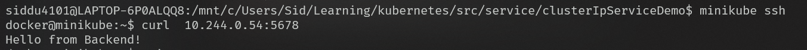

This confirms our backend pod is running and responding to requests.

#### b. Set Up Frontend Pod Communication 📡

Now let's create a frontend pod that will communicate with our backend:

```cmd
kubectl apply -f frontend.yaml
```

- Example output:
  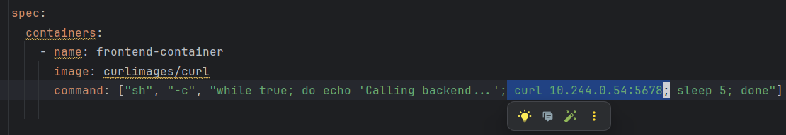


```cmd
kubectl logs frontend-pod -f
```

- Example output:
  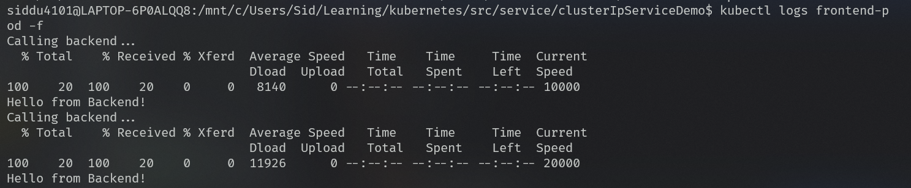

#### c. Create a Stable Service for Backend 🛡️

Instead of using the unstable pod IP (which changes when pods restart), let's create a ClusterIP service that provides a stable endpoint:

```cmd
kubectl apply -f backend-service-clusterIp.yaml
```

Check the created services:

```cmd
kubectl get services
```

- Example output:
  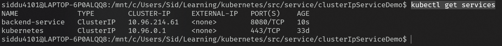

The service listens on port 8080 and forwards traffic to the backend pods. so updating frontend configuration to use the service name instead of the direct pod IP.

- Example output:
  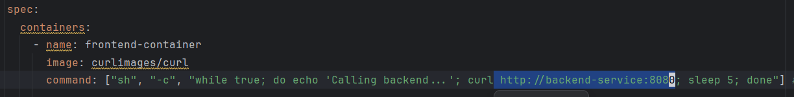

After updating the frontend to use the backend service,   and still receiving the same response but now through the stable service endpoint.

- Example output:
  

> ⚠️ **Important Note**: The service name (`backend-service`) is only resolvable by pods within the cluster via DNS resolution, not from the nodes. If you try to curl the service name from within the minikube node (via `minikube ssh`), it won't resolve the hostname.

- Example output:
  

---

## 3. NodePort 🚪
- **Purpose:** Exposes your application on each node’s IP at a static port, making it accessible from outside the cluster.
- **How it works:** NodePort services route external traffic to ClusterIP services, which then forward requests to the appropriate pods.
- **To create a NodePort service:**
  - Change the `type` field from `ClusterIP` to `NodePort` in your service YAML file.
  - Apply the configuration:
    ```cmd
    kubectl apply -f backend-service-nodeport.yaml
    ```
    - Example output:
      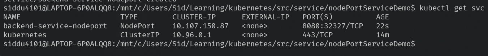
- **Accessing the app:**
  - The app is available at `http://<NodeIP>:<NodePort>` for any device that can reach the node (e.g., your host machine or LAN devices, if no firewall blocks it).
  - _Note:_ If running Minikube inside WSL (which uses Docker’s private network), you cannot access the app directly via `http://minikubeIp:nodePort` from your host.
  - To expose the service to your host machine, use:
    - Example output:
      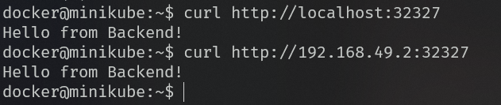
    ```cmd
    minikube service backend-service-nodeport
    ```
    - Example output:
      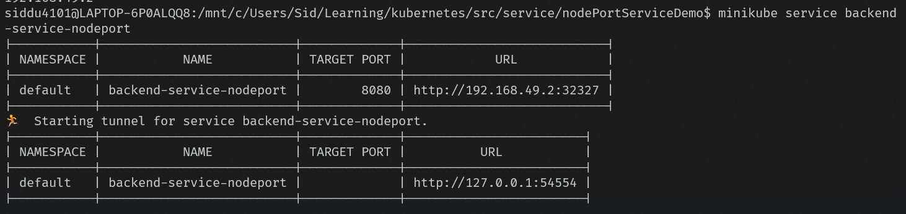
    This command creates a tunnel from your host to Minikube, allowing you to view the app in your browser. 🌐
    - Example output:
      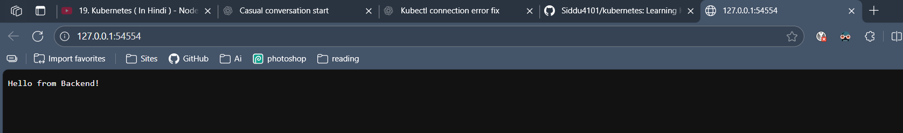

## 4. LoadBalancer 🌐
- **Purpose:** Expose your application to the Internet (or your cloud provider's network) with an external IP/DNS name managed by the cloud provider.
- **How it works:** A LoadBalancer-type Service asks the cloud provider to provision an external load balancer. The cloud load balancer routes traffic to the Kubernetes nodes (NodePorts) and then to the ClusterIP which forwards to matching pods.
- **To create a LoadBalancer service:**
  - Change the service `type` to `LoadBalancer` in your YAML and apply it:
    ```cmd
    kubectl apply -f backend-service-loadbalancer.yaml
    ```
- **Notes & environment differences:**
  - I am on local minikube which doesn't provision an external IP/DNS you need a cloud provider for that so alternatively use the which helps to access the service on host 
    ```cmd
    minikube tunnel
    ```
    or
    ```cmd
    minikube service backend-service-loadbalancer
    ```

## 5. ExternalName 🔗
- **Purpose:** Create a DNS alias inside the cluster that maps a Service name to an external DNS name (for example, to point a service to an external database or API).
- **How it works:** An ExternalName service does not select pods. Instead, Kubernetes returns a CNAME record for the Service that points to the `externalName` value. Traffic is resolved by DNS to the external host.
- **To create an ExternalName service:**
  - Use `type: ExternalName` and specify `externalName` in the service YAML. Example:
    ```yaml
    apiVersion: v1
    kind: Service
    metadata:
      name: my-external-db
    spec:
      type: ExternalName
      externalName: db.example.com
    ```
  - Apply the file:
    ```cmd
    kubectl apply -f my-externalname-service.yaml
    ```
- **Notes:**
  - An ExternalName service is not backed by pods and does not use `spec.selector`.
  - Use it when you want in-cluster DNS resolution for services that actually live outside the cluster (external managed services, legacy systems, etc.).

</details>

<details id="replicas">
<summary><strong>Replicas</strong></summary>

## Overview 🧩
- **Purpose:** Keep the desired number of pod replicas running to provide availability and scale for your application.
- **Why it matters:** Replicas ensure your app remains available if individual pods fail, and they make scaling predictable and declarative.

---

## 1. ReplicationController (legacy) 🛡️
- **Purpose:** The original controller for maintaining a set number of identical pods and this supports only equality-based selectors.
- **Notes:** It's mostly deprecated in favor of ReplicaSet and Deployment. It has limited features (no rolling updates, single-label selector) and is not recommended for new workloads.

---

## 2. ReplicaSet 🔁
- **Purpose:** Ensures a specified number of pod replicas are running at any time.
- **How it works:** A ReplicaSet watches pod labels and will create or delete pods so the actual count matches the desired `spec.replicas`.
- **When to use:** Rarely used directly; Deployments manage ReplicaSets for most workflows because Deployments provide rollout/rollback features and this supports both equality/label-based and expression-based selectors.

**What are label-based and expression-based selectors?** 🔎

- **Label-based (equality):** use `key=value` to select pods with that exact label (e.g., `app=frontend`).
  
- Ex: Matches Pods having both labels
    - `app=frontend` 
    - `env=prod`

```yaml
spec:
  replicas: 2
  selector:
    matchLabels:
      app: frontend
      env: prod
```

- **Expression-based (set):** use set-style operators like `In`, `NotIn`, `Exists`, and `DoesNotExist` (e.g., `env in (prod,staging)`). 
- Ex: Matches Pods where
    - `app` is either `backend` or `api` (In operator)
    - `AND` `tier` label `exists` (any value)

```yaml
spec:
  replicas: 3
  selector:
    matchExpressions:
      - key: app
        operator: In
        values:
          - backend
          - api
      - key: tier
        operator: Exists
```

| Operator       | Meaning                             | Example              | Matches          |
| -------------- | ----------------------------------- | -------------------- | ---------------- |
| `In`           | Key exists AND value is one of list | `env In (dev, prod)` | `env=dev` ✅      |
| `NotIn`        | Key exists AND value not in list    | `env NotIn (qa)`     | `env=prod` ✅     |
| `Exists`       | Key exists (any value)              | `env Exists`         | `env=anything` ✅ |
| `DoesNotExist` | Key absent                          | `env DoesNotExist`   | no `env` label ✅ |

> 🏷️ **Note:** Whenever you create a ReplicaSet, Kubernetes attaches an extra label (a unique hash) to each pod, in addition to the labels you specify.  
> This label helps with rolling updates by keeping two ReplicaSets active at a time and identifying which pod belongs to which ReplicaSet.  
> During updates (e.g., moving from V1 to V2), Kubernetes scales one ReplicaSet down to zero and the other up to the desired replica count, ensuring zero downtime.

---

## 3. Deployment 🚀
- **Purpose:** The recommended higher-level controller that manages ReplicaSets and provides rolling updates, rollbacks, and declarative updates.
- **How it works:** You declare a `Deployment` with a pod template and a `replicas` count. Kubernetes creates a ReplicaSet from that template and adjusts pod counts as needed. When you update the Deployment (for example, change the image), Kubernetes performs a rolling update by creating new pods and scaling down old ones.

- **Creating a simple deployment with replicas of 5**
```cmd
kubectl apply -f replica-set-via-deployment.yaml
```

- Example output:
  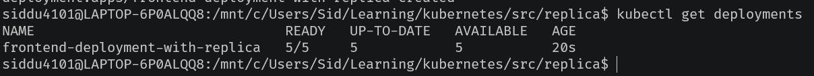
  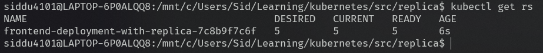
- **Here you can see as mentioned Replicaset created pods will have one extra label as hash for rolling updates**
  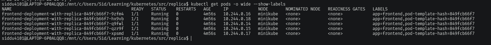

- **Verify Replica behavior** 🔍
  - Delete a pod and confirm the ReplicaSet recreates it automatically:
    ```cmd
    kubectl delete pod frontend-deployment-with-replica-849fcb66f7-q9fwl
    kubectl get rs -w
    ```

  - Example output:
    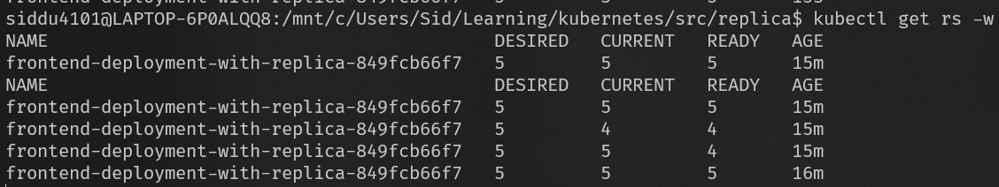

  - **Expose the replicas with a NodePort service** 🚪
    ```cmd
    kubectl apply -f replica-service-nodeport.yaml
    kuectl describe svc replica-service-nodeport | grep Endpoints
    or
    kubectl get endpoints replica-service-nodeport 
    
  - Example output:
    

  - **Open the service in your host browser (Minikube):**
    ```cmd
    minikube service replica-service-nodeport # opens the service in the host browser or creates a tunnel if required
    ```

  - Example output:
    


  ### Rolling updates (zero-downtime) 🔁

  Deployments perform rolling updates by gradually replacing old pods with new ones so your application stays available during updates.

- Updating the deployment to use v2 version image and re-apply it:

    ```cmd
	 kubectl apply -f replica-set-via-deployment.yaml
    ```


  Verify and monitor the rollout:

  - You should now see the new ReplicaSet running all five new pods while the previous ReplicaSet has scaled down to 0. ✅

  - Example output:
    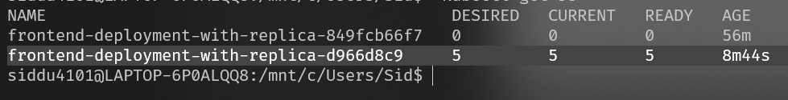

  - Example output:
    

**NOTE:**
```yaml
strategy:
  type: RollingUpdate  # Default strategy for Deployments
  rollingUpdate:
    maxUnavailable: 25%  # Maximum percentage (or number) of old pods that can be unavailable during the update
    maxSurge: 25%        # Maximum percentage (or number) of extra pods that can be created above the desired count during the update
```

- **Strategy Types:**
    - `Recreate`: Terminates all existing pods before creating new ones (downtime occurs)
    - `RollingUpdate`: Gradually replaces old pods with new ones, ensuring zero downtime
- `maxUnavailable`: Specifies how many old pods can be unavailable during the update
- `maxSurge`: Specifies how many extra pods (old + new) can be running during the update

> **Note:** If `maxSurge` > `maxUnavailable`, the extra surge acts as a buffer pool, providing additional pods when needed for a smoother update.

  - Deleting the Deployment also removes the ReplicaSet and pods that it manages. 🗑️

    ```cmd
    kubectl delete -f replica-set-via-deployment.yaml
    ```

  - Example output:
    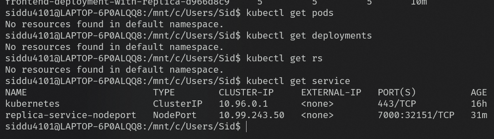

  - Note: The Service is independent of the Deployment and will remain after deletion. ⚠️


**🚀 Rollout Options**

Here are some useful `kubectl rollout` commands for managing deployments:

| Command | Description |
|---------|-------------|
| kubectl rollout history deployment frontend-deployment-with-replica | 📜 View rollout history |
| kubectl rollout pause deployment frontend-deployment-with-replica | ⏸️ Pause the deployment |
| kubectl rollout restart deployment frontend-deployment-with-replica | 🔄 Restart the deployment |
| kubectl rollout resume deployment frontend-deployment-with-replica | ▶️ Resume a paused deployment |
| kubectl rollout status deployment frontend-deployment-with-replica | 📈 Show rollout status |
| kubectl rollout undo deployment frontend-deployment-with-replica | ⏪ Undo a previous rollout |

---

### 📝 Example: Viewing Rollout History

Suppose your deployment has been updated 4 times:
- 1️⃣ version v1
- 2️⃣ version v2
- 3️⃣ version latest

You can see the history with:
```cmd
kubectl rollout history deployment frontend-deployment-with-replica
```

> 💡 **Note:** You can see the `change-cause` message if you have added an annotation in the deployment's metadata.

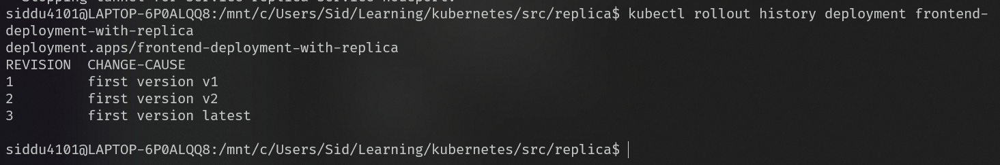


Now if u want to switch back the previous version u can use 
- To undo the last rollout and revert to the previous version, use:

```cmd
kubectl rollout undo deployment frontend-deployment-with-replica
```

- Example output:
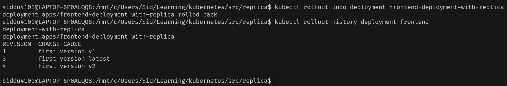


again if u do the undo it will move back to the last version that is latest like a toggle
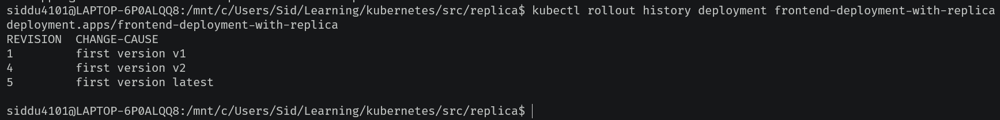

- To undo the rollout and revert to a specific revision (e.g., revision 1), use:

```cmd
kubectl rollout undo deployment frontend-deployment-with-replica --to-revision=1
```

- Example output:
  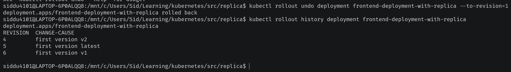

</details>

<details id="deployment">
<summary><strong>Deployment</strong></summary>

## 🚦 Resource Requests & Limits in Kubernetes

If you want to restrict the **CPU** or **memory** usage for a container (either lower or upper bound), you can use the `resources` key in your Pod or container spec.

- **requests**: Minimum resources required for the Pod to be scheduled on a node. If the node doesn't have at least this much available, the Pod will remain in `Pending` status.
- **limits**: Maximum resources the Pod can use. If the Pod tries to exceed these limits:
    - For CPU: It will be throttled (slowed down).
    - For Memory: It will be terminated with an `OOMKilled` error (Out Of Memory).
```cmd
kubectl apply -f resource-limit-pod.yaml
```
### 📝 Example YAML for Resource Requests & Limits
```yaml
resources:
  requests:
    cpu: 100m        # Scheduler checks for at least 100 millicores CPU
    memory: 512Mi    # Scheduler checks for at least 512 MiB memory
  limits:
    cpu: 500m        # Max 0.5 CPU; beyond this, throttling occurs
    memory: 1024Mi   # Max 1024 MiB; beyond this, OOMKilled error
```
to see the above configuration you can use the 
```cmd
kubectl describe pod resource-limit-test-pod
```

### 📏 Units Explained
- **CPU** is measured in millicores:
    - `1000m` = 1 core
    - `500m` = 0.5 core
    - `250m` = 0.25 core

- **Memory** can be specified in binary (power of 2) or decimal (power of 10) units:
    - **Binary (IEC):**
        - `1Ki` = 1024 bytes
        - `1Mi` = 1024 × 1024 bytes
        - `1Gi` = 1024 × 1024 × 1024 bytes
        - `1Ti` = 1024 × 1024 × 1024 × 1024 bytes
    - **Decimal (SI):**
        - `1K` = 1000 bytes
        - `1M` = 1000 × 1000 bytes
        - `1G` = 1000 × 1000 × 1000 bytes
        - `1T` = 1000 × 1000 × 1000 × 1000 bytes
</details>

<details id="namespace">
<summary><strong>Namespace</strong></summary>

## Namespace 🗂️

Namespaces are logical partitions within a Kubernetes cluster, allowing you to organize and isolate resources. By default, all created objects reside in the `default` namespace.

**Kubernetes provides 4 namespaces by default:**
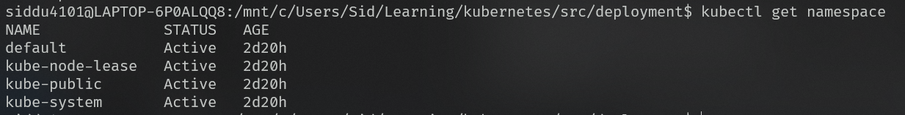
- **default**: Where objects without a specified namespace are stored
- **kube-system**: Cluster-related objects (etcd, API server, DNS, etc.)
- **kube-public**: Publicly readable resources
- **kube-node-lease**: Used by nodes for heartbeat signals

### Why use namespaces? 🤔
- Isolate network and resources
- Allow objects with the same name in different namespaces
- Set resource limits/quotas per namespace
- Separate environments (dev, prod, uat)
- RBAC(role based access control) can be done


### Check the scope of Kubernetes objects

```cmd
kubectl api-resources
```
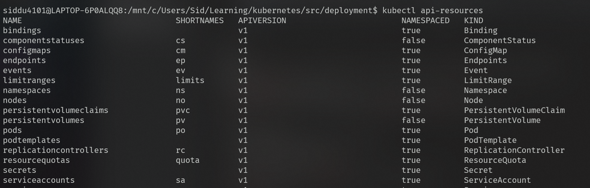

> By default, commands operate in the `default` namespace.

---

### Create a Pod in a different namespace

**a. Using command-line options:**

```cmd
kubectl create namespace test
kubectl run pod-in-test-ns --image=nginx --namespace=test
# Or use shorthand:
kubectl run pod-in-test-ns --image=nginx -n test
kubectl get pods --namespace=test
```
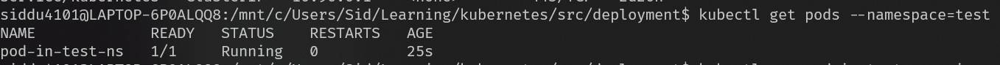

**b. Using a YAML file:**

```yaml
apiVersion: v1
kind: Pod
metadata:
  name: pod-in-test-ns
  namespace: test
  labels:
    app: a-test-ns-pod
spec:
  containers:
  - name: pod-in-test-ns
    image: nginx
```

---

### View pods across all namespaces

```cmd
kubectl get pods --all-namespaces
```
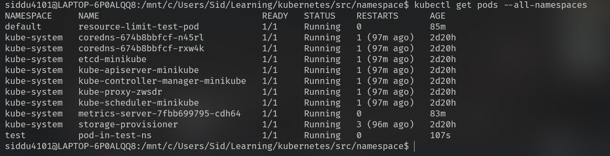

If you don't want to type the namespace for each command, you can set your namespace as the default using:

```yaml
kubectl config set-context --current --namespace=test
```


### 🌐 Communication Between Namespaces

Suppose you have:
- 1️⃣ A database in the **default** namespace
- 2️⃣ Web services: one in **default** and one in **test** namespace

When you connect to the database via a service in the default namespace from the web service in the default namespace, it works fine.

**Create resources in the default namespace:**
```cmd
kubectl apply -f database-default-ns.yaml
kubectl apply -f database-default-ns-service.yaml
kubectl apply -f webservice-default-ns.yaml
kubectl apply -f webservice-test-ns.yaml
```

**Test communication from the default namespace web service:**
```cmd
kubectl exec -it ws-default-ns -- bash
curl database-default-ns-service
```
✅ Communication is successful!
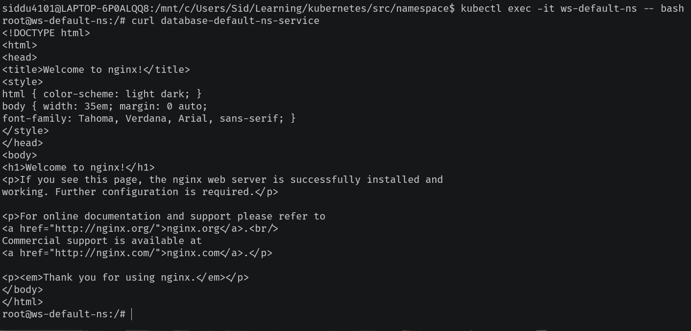

**Test communication from the test namespace web service:**
```cmd
kubectl exec -n test -it ws-test-ns -- bash
curl database-default-ns-service
```
❌ Host could not be resolved (because of different namespace).
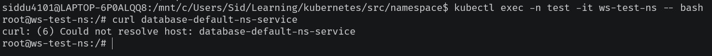

To fix this, use the full service name with namespace:

>  It couldn't resolve the host because of different namespace. To avoid this, use the full service name with namespace in this format:
>
> `<service-name>.<namespace>.svc.cluster.local`

Now, try accessing the database service again:

```cmd
curl database-default-ns-service.default.svc.cluster.local
```
✅ Now the service/database is accessible!
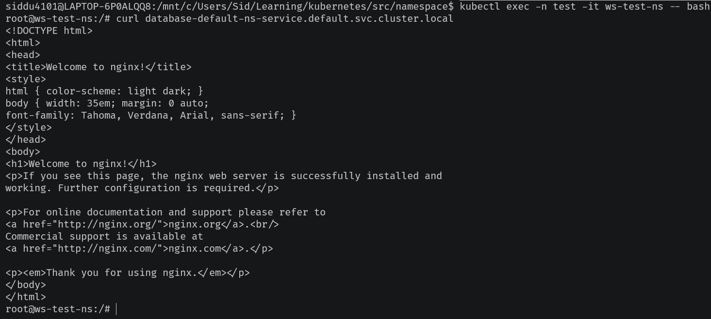


## 🛡️ Resource Quota in Namespace

## 1. **Object Quota**
Restrict the number of objects of a specific kind (e.g., pods) that can exist in a namespace.
- Example: Limit the number of pods in the `test` namespace to 2. If you try to create more, you'll get a quota exceeded error.

---

### 🔍 Check Existing Resource Quota
```cmd
kubectl create ns test
kubectl describe resourcequota -n test
```
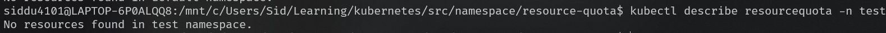
> By default, there are no resource quota limits, and you can use all cluster resources.

---

### ➕ Add Object Quota Constraints
```cmd
kubectl apply -f object-quota.yaml -n test
```
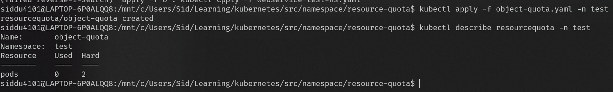

---

### 🚀 Create Pods in the Namespace
```cmd
kubectl apply -f pod.yaml
```
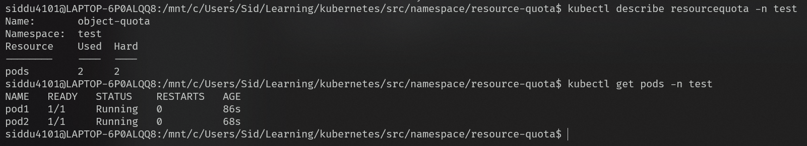

Now, try to create another pod and see the quota enforcement in action!
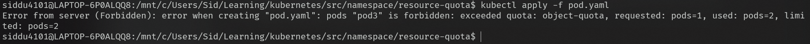


## 2. **Compute Resource Quota (Without LimitRange)**

You can set limits on the total CPU and memory requests/limits for a namespace. This restricts the combined resources of all objects in that namespace.

**Example YAML for Compute Quota:**
```yaml
spec:
  hard:
    requests.cpu: "0.5"      # 🖥️ Max total CPU requests in this namespace
    requests.memory: "500Mi" # 🧠 Max total memory requests in this namespace
    limits.cpu: "1"          # 🖥️ Max total CPU limits in this namespace
    limits.memory: "1Gi"     # 🧠 Max total memory limits in this namespace
```

**Apply the compute quota:**
```cmd
kubectl apply -f compute-quota.yaml
```
- Example output:
  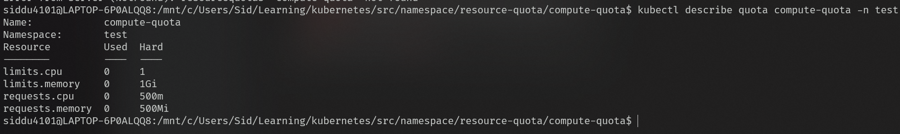

Now, let's create a pod **without** specifying requests/limits:
```cmd
kubectl apply -f pod-without-request-limits.yaml
```
- Example output:
  

**Create a pod with only limits:**
```cmd
kubectl apply -f pod-with-limits.yaml -n test
```

**Check the quota details:**
```cmd
kubectl describe quota compute-quota -n test
```
- Example output:
  

Notice: Even without specifying requests, the pod infers requests from the limits.

**Describe the pod to see inferred requests:**
```cmd
kubectl describe pod pod-with-limits -n test
```
- Example output:
  

Now, let's try to create another pod that **exceeds the limits** (e.g., update name and set CPU limit to 750m):
```cmd
kubectl apply -f pod-with-limits.yaml -n test
```
- Example output:
  


<details id="limitrange">
<summary><h2><strong>🛡️ LimitRange in Namespace</strong></h2></summary>

LimitRange lets you set default resource requests and limits for containers in a namespace, so you don't have to specify them every time. It also enforces min/max values and ratios for limits/requests.

**What can LimitRange do?**
- Assign default requests if not specified
- Assign default limits if not specified
- Enforce minimum and maximum values
- Enforce maxLimitRequestRatio

**Step-by-step:**

Create a namespace for LimitRange
Apply a LimitRange YAML:
```cmd
kubectl create ns limit-range-ns
kubectl apply -f limit-range.yaml
```


Create a pod without any resource definition (which is not possible with only compute-quota):
```cmd
kubectl apply -f pod.yaml
```


 Try to violate a rule (e.g., set CPU > 1 i am trying to create a pod with 1.5 CPU):
```cmd
kubectl apply -f pod-with-exceeding-cpu.yaml
```


</details>
</details>


<details id="configmap">
<summary><strong>Configmap</strong></summary>

## 🗂️ ConfigMaps
ConfigMaps are Kubernetes API objects used to store non-sensitive configuration data as key-value pairs. This approach decouples configuration from application containers/images, allowing dynamic configuration without rebuilding images. ConfigMaps are accessible inside pods.

### Ways to Create a ConfigMap

1. **Via Literal** 📝
   - Create a ConfigMap from simple key-value pairs.
   - Example:

     ```cmd
     kubectl create configmap cm-from-literal --from-literal=key1=val1 --from-literal=key2=val2
     kubectl describe cm cm-from-literal
     ```
     

2. **Via File** 📄
   - Use file names as keys and their contents as values. No formatting is required; useful for mounting config files in containers.
   - Example:

     ```cmd
     kubectl create cm cm-from-file --from-file=application.properties --from-file=application-dev.properties
     ```
     

   - You can also specify a whole directory:

     ```cmd
     kubectl create cm cm-from-directory --from-file=./cmFromFile
     ```
     

3. **Via Env File** 🌱
   - Use a file with `KEY=VALUE` pairs. Comments and empty lines are ignored. Each line becomes a key-value pair, ideal for setting environment variables.
   - Example:

     ```cmd
     kubectl create cm cm-from-env-file --from-env-file=devConfig.env
     ```
     

4. **Via YAML** 📑
   - Define a ConfigMap using a YAML manifest.
   - Example:

### 📝 ConfigMap from Literal
```yaml
metadata:
  name: cm-from-literal
data:
  mode: "prod"
  timeout: "30"
```

### 📄 ConfigMap from Single File
```yaml
metadata:
  name: cm-from-single-file
data:
  app.properties: | # pipe separates the file content and the key(filename)
    app.mode=prod
    app.timeout=20
```

### 📁 ConfigMap from Multiple Files/Directory
```yaml
metadata:
  name: cm-from-directory
data:
  config.yaml: |
    app:
      name: sample
      version: 1.0
  settings.json: |
    {
      "enabled": true,
      "threshold": 15
    }
```

### ⚙️ ConfigMap from Env File
```yaml
metadata:
  name: cm-from-env-file
data:
  MODE: "dev"
  PORT: "8080"
  TIMEOUT: "60"
```

 ```cmd
 kubectl apply -f cm-from-yaml.yaml
 ```
 

### Usage of the ConfigMap Inside the Pod 🗂️
  You can use a ConfigMap inside a pod in three main ways:

  1. **envFrom**: Import multiple keys from a ConfigMap as environment variables at once (supports prefixing) 🧩
  2. **env**: Import a single key from a ConfigMap as an environment variable (can rename the variable) 🔑
  3. **volumeMount**: Mount files from a ConfigMap as volumes and access them inside the pod 📁

  ---

  ### 1️. 🎋Using envFrom to Import All Keys

  > ⚠️ **Important:**
  > - ConfigMap keys should not contain special characters.
  > - For file-based ConfigMaps, the filename becomes the environment variable key and the file content becomes the value.
  > - For env and literal ConfigMaps, each line is treated as a key-value pair and imported as environment variables.
  > - If your file name contains a dot (`.`), it may not be valid as an environment variable name in Kubernetes.
  > - Example:  I have 1 literal cm as above and 1 env-file cm as above will create a simple file `simpleFile`, it works. But a file named `simple.file` will violate the environment variable naming rules.

  **Create simpleFile configMap**

  ```cmd
  kubectl create cm simple-file-cm --from-file=simpleFile
  ```
  

  **Sample pod spec using multiple ConfigMaps with envFrom:**

  ```yaml
  containers:
    - image: nginx
      name: nginx-container
      envFrom:
        - configMapRef: # from literal ConfigMap
            name: cm-from-literal
          prefix: B_ # Prefix for all env vars from this ConfigMap
        - configMapRef: # from env file ConfigMap
            name: cm-from-env-file
          prefix: A_
        - configMapRef: # from file-based ConfigMap
            name: simple-file-cm
  ```

  **Apply and test:**

  ```cmd
  kubectl apply -f cm-usage.yaml
  kubectl exec -it cm-usage-via-env-var -- bash
  env
  ```
  [](resource/configmap/configMapUsage/usingEnvFromForDifferentCm.png)

  **Result:**
  - Environment variables from ConfigMaps:
    - `mode`, `timeout` (from literal)
    - `PORT`, `MODE` (from env file)
    - `simpleFile` (from file-based ConfigMap)

  You can add a prefix to each env key if you have multiple variables with the same name in different ConfigMaps. For example, if both `cm-from-env` and `simple-file-cm` have a `mode` key, you can use `A_` for env-cm and `B_` for single-file-cm.

  [](resource/configmap/configMapUsage/usingEnvFromWithPrefix.png)
  ---

  ### 2️. 🗝️Using env to Import a Single Key

  > - ⚠️ This method does not work with `envFrom`. Use `env` to pick specific keys from a ConfigMap and optionally rename them.
  > - The `env` field only imports a single key from a ConfigMap, not all keys.
  > - You can pick any key from the ConfigMap, rename it if needed, and make it available as an environment variable in your pod.

  You can also provide static key-value pairs for environment variables.

  **Example we will try to pick only PORT from the env-cm and see the result**
  

  ```yaml
  containers:
    - image: nginx
      name: nginx-container
      env:
        - name: version # Static env var
          value: "1.0.0"
        - name: environment
          value: DEV
        - name: ENV_VAR_FROM_CM # The PORT from cm-from-env will be available as this name in env and this is env from secret
          valueFrom:
            configMapKeyRef:
              name: cm-from-env-file # ConfigMap name
              key: PORT # Key to import from ConfigMap
  ```

  **Apply and test:**

  ```cmd
  kubectl apply -f env-usage.yaml
  kubectl exec -it env-and-cm-usage -- bash
  env
  ```
  [](resource/configmap/configMapUsage/usingEnvForStaticAndCmUsage.png)
  **Result:**
  - `version`, `environment` from static env
  - `ENV_VAR_FROM_CM` from ConfigMap

  ---
  ### 3. 📁 Mounting ConfigMap as a Volume

  We can mount ConfigMap files as volumes in your pod. This is useful for providing configuration files to your application in a read-only, immutable way.

  **Features:**
  - You can select specific files/keys from the ConfigMap to mount.
  - You can rename the file when mounting it to the volume.
  - This works with all types of ConfigMaps.

  **Example:**
  We have a ConfigMap `cm-from-dir` with two files: `settings.json` and `config.yaml`. You want to mount only `config.yaml`, rename it to `config_for_volume_mount.yaml`, and mount it at `/etc/config` in your pod.

  **YAML:**
  ```yaml
  containers:
  - image: nginx
    name: ngnix-cotainer
    volumeMounts:
      - name: valume-for-config-map # should match with volume name where u have mentioned the cm
        mountPath: /etc/config # path were we store the files inside the pod

  volumes:
    - name: valume-for-config-map #volume for storage of cm files
      configMap:
        name: cm-from-directory # cm from whihch we get the files to mount
        items: # this is optoional if u skip it will add all the files to the 'monthPath'
         - key: config.yaml #cm to be choosen from the above cm and and skipped settings.json another file in the above cm
           path: config_for_volume_mount.yaml #renamed the selected file from the cm
  ```

  **Commands:**
  ```cmd
  kubectl apply -f cm-via-volume.yaml
  kubectl exec -it cm-usage-via-volume-mount -- bash
  cd /etc/config
  ls -ltr
  cat config_for_volume_mount.yaml
  ```
  [](resource/configmap/configMapUsage/usingCmViaVolumeMount.png)
</details>

<details id="secret">
<summary><strong>Secret</strong></summary>

Secrets:

## 🔐 Secrets in Kubernetes

Secrets are similar to ConfigMaps, but they add an extra layer of security by encoding values in base64. This is mainly used for sensitive data such as SSH keys, TLS certificates, Docker registry credentials, and Kubernetes tokens for API server authentication.

### Secret Types & Purposes
| Secret Type            | Purpose                                 |
|-----------------------|------------------------------------------|
| Opaque                | Generic key-value sensitive data         |
| service-account-token | Auto-generated for service account auth  |
| dockerconfigjson      | Private registry pull credentials        |
| basic-auth            | Username and password                    |
| ssh-auth              | SSH private key                          |
| tls                   | TLS cert + key                           |
| bootstrap token       | kubeadm node join tokens                 |

> ⚠️ **Note:** Both ConfigMap and Secret objects can store a maximum of **1MB** per object.

---
### 1. Create Secret via Literal
```cmd
kubectl create secret generic secret-from-literal --from-literal=mode=prod --from-literal=timeout=30
kubectl get secret secret-from-literal -o yaml
echo "cHJvZA==" | base64 --decode   # prod
echo "MzA=" | base64 --decode      # 30
```


---
### 2. Create Secret via File
```cmd
kubectl create secret generic secret-from-file --from-file=application.properties --from-file=application-dev.properties
kubectl get secret secret-from-file -o yaml
echo "I2FwcGxpY2F0aW9uIGRldiBwcm9lcHJ0aWVzCgpkYlVzZXI9cmFqCmRiTmFtZT1kZXZfZGF5b25lCg==" | base64 --decode
echo "I2FwcGxpY2F0aW9uIHByb3BlcnR5IGZpbGUKCmRiVXNlcj1zaWQKZGJOYW1lPWRheW9uZQo=" | base64 --decode
```


---
### 3. Create Secret via Directory
```cmd
kubectl create secret generic secret-from-directory --from-file=./
```


---
### 4. Create Secret from Env File
```cmd
kubectl create secret generic secret-from-env-file --from-env-file=devConfig.env
kubectl get secret secret-from-env-file -o yaml
echo "ZGF5b25l" | base64 --decode   # dayone
echo "dHJ1ZQ==" | base64 --decode   # true
echo "ODA4MA==" | base64 --decode   # 8080
```


---
### 5. Create Secret via YAML

**From literal/static:**
```yaml
apiVersion: v1
kind: Secret
metadata:
  name: secret-from-literal
type: Opaque
data:
  mode: "cHJvZA=="        # prod
  timeout: "MzA="         # 30
```

**From files/directory:**
```yaml
apiVersion: v1
kind: Secret
metadata:
  name: secret-from-file
type: Opaque
data:
  application.properties: |
    I2FwcGxpY2F0aW9uIHByb3BlcnR5IGZpbGUKCmRiVXNlcj1zaWQKZGJOYW1lPWRheW9uZQo=
  application-dev.properties: |
    I2FwcGxpY2F0aW9uIGRldiBwcm9lcHJ0aWVzCgpkYlVzZXI9cmFqCmRiTmFtZT1kZXZfZGF5b25lCg==
```

**From env file:**
```yaml
apiVersion: v1
kind: Secret
metadata:
  name: secret-from-env-file
type: Opaque
data:
  MODE: "ZGV2"         # dev
  PORT: "ODA4MA=="     # 8080
  TIMEOUT: "NjA="      # 60
```

```cmd
kubectl apply -f secret-from-yaml.yaml
kubectl get secret secret-from-env-file -o yaml
```


   
## 🔐 Usage of Secret Inside the Pod

You can inject secrets into a pod in three main ways, similar to ConfigMap usage:

### 1 Inject via `env` (Environment Variable)
You can expose a specific key from a Secret as an environment variable, create static env vars, and rename the env var as needed.

**Example Pod Spec:**
```yaml
containers:
  - image: nginx
    name: nginx-container
    env:
      - name: version # Static env var
        value: "1.0.0"
      - name: environment
        value: DEV
      - name: ENV_VAR_FROM_SECRET # The PORT from secret-from-env will be available as this name
        valueFrom:
          secretKeyRef:
            name: secret-from-env-file # Secret name
            key: PORT # Key to import from Secret
```

**Commands:**
```cmd
kubectl apply -f secret-usage-via-env.yaml
kubectl exec -it secret-usage-via-env -- bash
env
```


---

### 2 Inject via `envFrom` (Bulk Environment Variables)
Expose multiple keys from one or more Secrets as environment variables at once. You can add a prefix to avoid conflicts if you have the same key in different Secrets. ⚠️ Filenames with special characters (like `.`) won't work as env vars, so use simple filenames.

**Create a simple file secret:**
```cmd
kubectl create secret generic simple-file-secret --from-file=simpleFile
kubectl get secret simple-file-secret -o yaml
# Decode the file content
echo "I3RoaXMgaXMgYSBzaW1wbGUgZmlsZSBmb3IgY20KCkhlbGxvIEkgYW0gU2lkIQpJIGFtIGEgc29mdHdhcmUgZW5naW5lZXIK" | base64 --decode
```


**Example Pod Spec:**
```yaml
apiVersion: v1
kind: Pod
metadata:
  name: secret-usage-via-env-from
spec:
  containers:
    - image: nginx
      name: nginx-container
      envFrom:
        - secretRef:
            name: secret-from-literal
          prefix: B_
        - secretRef:
            name: secret-from-env-file
          prefix: A_
        - secretRef:
            name: simple-file-secret
```

**Commands:**
```cmd
kubectl apply -f secret-usage-via-envFrom.yaml
kubectl exec -it secret-usage-via-env-from -- bash
env
```


**Result:**
- `A_MODE`, `A_PORT`, `A_TIMEOUT` → from `secret-from-env-file` Secret
- `B_mode`, `B_timeout` → from `secret-from-literal` Secret
- `simpleFile` → from `simple-file-secret` Secret (contains file content)

---

### 3 Inject via VolumeMount 📁
Create a volume and mount Secret files inside the pod. You can select specific files and rename them when mounting.

**Example Pod Spec:**
```yaml
spec:
  containers:
    - image: nginx
      name: nginx-container
      volumeMounts:
        - name: volume-for-secret
          mountPath: /etc/secrets
  volumes:
    - name: volume-for-secret
      secret:
        secretName: secret-from-directory
        items:
          - key: application-dev.properties
            path: secret_for_volume_mount.yaml
```

**Commands:**
```cmd
kubectl apply -f secret-usage-via-volume.yaml
kubectl exec -it secret-usage-via-volume-mount -- bash
cd /etc/secrets/
cat secret_for_volume_mount.yaml
```

</details>

<details id="taints-and-toleration">
<summary><strong>Taints and Toleration</strong></summary>

## ⚖️ Taints and Tolerations

Taints and Tolerations work together to control which pods can be scheduled on which nodes in Kubernetes.

### 🛑 What is a Taint?
A **taint** is applied to a node to repel pods. It tells Kubernetes:
> "Do NOT place pods on this node unless they have a matching toleration."

Format: `key=value:effect`

### ✅ What is a Toleration?
A **toleration** is applied to a pod. It tells Kubernetes:
> "I am OK to run on nodes with this taint."

---

### 🤔 Why Use Taints and Tolerations?
- To ensure only selected pods run on specific nodes.
- Kubernetes automatically applies taints if a node is not-ready or unreachable, preventing scheduling and deleting pods on that node.

Some common taints applied by Kubernetes:
- `node.kubernetes.io/unreachable:NoExecute`
- `node.kubernetes.io/not-ready:NoExecute`

All pods get two default tolerations:
- `node.kubernetes.io/not-ready:NoExecute` (operator: Exists, for 300s)
- `node.kubernetes.io/unreachable:NoExecute` (operator: Exists, for 300s)

> This allows pods to stay on unreachable/not-ready nodes for 5 minutes before being deleted if the node doesn't recover.

---

### 📝 Toleration YAML Example
```yaml
tolerations:
  - key: "example-key"
    operator: "Equal"
    value: "example-value"
    effect: "NoSchedule"
    tolerationSeconds: 60
```

#### Toleration Fields Explained
- **key**: Key of the taint the pod can tolerate. If empty, matches all taints.
- **operator**: `Equal` (default) or `Exists`. `Equal` matches key and value; `Exists` matches only the key.
- **value**: Value of the taint (used only with `Equal`).
- **effect**: `NoSchedule` | `PreferNoSchedule` | `NoExecute`. If empty, matches all effects.
- **tolerationSeconds**: Only for `NoExecute`. Number of seconds the pod can tolerate the taint. If not defined, pod can stay forever.

---

### 🛠️ Taint Effects
#### 1. **NoSchedule**
Pod will not be scheduled on this node unless toleration matches. If the taint is applied after pods already exist, it won't affect them—only new pods.

#### 2. **PreferNoSchedule**
Kubernetes will try to avoid scheduling pods on the node, but it's not guaranteed.

#### 3. **NoExecute**
Existing pods will be evicted unless they tolerate the taint. And if it is new pod it must match taint to sustain.

---

### 1.🙅 NoSchedule Effect
If a node has a `NoSchedule` taint, pods will **not** be scheduled on this node unless they have a matching toleration.
- If the taint is applied after pods already exist, those pods are **not affected**—the rule only applies to new incoming pods.
- For example: If I add a taint and then create a pod without any toleration, it will remain in the **Pending** state (especially in a single-node Minikube setup).
#### a. When pods are already present on the node
```cmd
kubectl get pods
```


```cmd

kubectl taint node minikube key=value:NoSchedule
kubectl describe node minikube | grep Taint
kubectl get pods
kubectl delete pod taints-and-toleration
```


#### b. When a new pod without toleration is created
```cmd
kubectl apply -f without-toleration-pod.yaml
kubectl get pods
```


#### c. When a pod with toleration is created
```yaml
tolerations:
  - key: key #key of the taint present on the node you want this pod to be tolerate
    # operator: Equal # operator by default Equal(must match key and value of taint) you can use Exists (ignores value)
    value: value # value of the taint (only used when operator = Equal)
    effect: NoSchedule

```
```cmd
kubectl apply -f pod-with-toleration.yaml
kubectl get pods
kubectl describe pod pod-with-toleration
```


#### Remove the taint from the node
```cmd
kubectl taint node minikube key-
```


---

### 2. 🤷 PreferNoSchedule Effect
The `PreferNoSchedule` taint tries **not** to schedule pods that don't tolerate the taint, but it does **not guarantee** that pods will be blocked from the node. If pods are already running and you apply the taint, those pods will **not** be deleted.

In a single-node cluster (like Minikube), pods may still be scheduled on the node even with this taint.

---

##### a. Pod already running, then taint is applied
```cmd
kubectl apply -f pod-with-no-toleration.yaml
kubectl get pods
kubectl taint node minikube key=value:PreferNoSchedule
kubectl describe node minikube | grep -A 5 Taints
kubectl get pods
```


##### b. New pod without toleration
```cmd
kubectl apply -f pod-with-no-toleration.yaml
kubectl get pods
```


##### c. Pod with toleration
```yaml
tolerations:
  - key: key # key of the taint present on the node you want this pod to tolerate
    operator: Exists # operator by default is Equal; Exists ignores value
    #value: value # value of the taint (only used when operator = Equals)
    effect: PreferNoSchedule
```
```cmd
kubectl apply -f pod-with-prefernoschedule-toleration.yaml
kubectl get pods
kubectl describe pod pod-with-prefernoschedule-toleration | grep -A 5 Tolerations
```

### 3. 🚫 NoExecute Effect
The `NoExecute` taint both prevents scheduling of new non‑tolerating pods (like `NoSchedule`) **and** evicts already running pods that do not tolerate it.

Eviction rules:
- With `tolerationSeconds`: pod stays for that duration, then is evicted. ⏱️
- Without `tolerationSeconds`: pod may remain indefinitely. ♾️

#### a. When pods are already present and taint is applied
Existing pods without a matching toleration are evicted.
```cmd
kubectl apply -f pod-with-no-toleration.yaml
kubectl get pods
kubectl taint node minikube key=value:NoExecute
kubectl describe node minikube | grep -C 3 Taints
kubectl get pods
```


#### b. New pod without toleration
Pod cannot be scheduled (single node) or is scheduled elsewhere; if it lands on the tainted node it is evicted.
```cmd
kubectl apply -f pod-with-no-toleration.yaml
kubectl get pods
```


#### c. Pod with toleration (temporary)
Stays only for the specified seconds then evicted.
```yaml
tolerations:
  - key: key            # taint key on the node
    operator: Exists    # 'Exists' ignores value; use 'Equal' to match value
    # value: value      # uncomment if operator: Equal and value must match
    effect: NoExecute
    tolerationSeconds: 30  # stays 30s then evicted
```
```cmd
kubectl apply -f pod-with-noexecute-toleration.yaml
kubectl get pods -w
```


#### d. Pod with toleration (no expiration)
Remove or comment `tolerationSeconds` to allow indefinite stay.
```cmd
kubectl apply -f pod-with-noexecute-toleration.yaml   # tolerationSeconds removed/commented
kubectl get pods -w
kubectl get pods
kubectl describe pod pod-with-noexecute-toleration | grep -C 3 Tolerations
```


#### NOTE: Universal toleration (match everything)
Use sparingly; it permits scheduling on any tainted node.
```yaml
tolerations:
  - operator: Exists
```

</details>

<details id="node-selector">
<summary><strong>Node Selector</strong></summary>

## 🎯 What Is a Node Selector?

`nodeSelector` is the simplest built‑in scheduling constraint. It tells the scheduler to place the Pod only on nodes that have ALL the exact key/value labels matches.

### 🤔 Why Use It?
- 🏷️ Environment separation (e.g., `env=prod` vs `env=dev` nodes)
- 🔐 Restrict sensitive workloads to hardened / isolated nodes
- 🖥️ Target special hardware (GPU, high‑memory, SSD, ARM)
- 🧪 Keep test jobs on disposable nodes

> ⚠️ `nodeSelector` only supports exact match. For more expressive matching (In / NotIn / Exists) we need to use `nodeAffinity`. For exclusion use `taints & toleration's`.

### 🧩 How It Works
1. Label the node(s): `kubectl label node <nodeName> key=value`.
2. Add `nodeSelector:` to the Pod spec with the same key/value.
3. If no node matches, the Pod stays `Pending` until a matching node appears.
4. If it finds one it will be scheduled on that node

---

###  Case A: Pod with no node selector and node has node=minikube label 🔖
Pod without `nodeSelector` (it can run on any node).

```cmd
kubectl get nodes --show-labels
kubectl label node minikube node=minikube
kubectl get nodes --show-labels
kubectl apply -f pod-with-no-node-selector.yaml
kubectl get pods --show-labels
```


---

### Case B: Pod With Matching Node Selector ✅
This Pod will schedule because the node has `node=minikube` and pod has matching nodeSelector.

```yaml
apiVersion: v1
kind: Pod
metadata:
  name: pod-with-node-selector
spec:
  containers:
    - name: container-with-node-selector
      image: nginx
  nodeSelector:
    node: minikube
```

```cmd
kubectl apply -f pod-with-node-selector.yaml
kubectl get pods -o wide
```


---

### Case C: Pod With Non‑Matching Node Selector ❌
Requests a label that no node has (`node=worker`), so it will stay `Pending`.

```yaml
apiVersion: v1
kind: Pod
metadata:
  name: pod-with-wrong-node-selector
spec:
  containers:
    - name: container-with-wrong-node-selector
      image: nginx
  nodeSelector:
    node: worker
```

```cmd
kubectl apply -f pod-with-wrong-node-selector.yaml
kubectl get pods
```


Remove the node label
```cmd
kubectl label node minikube node-
kubectl get nodes --show-labels
```

</details>

<details id="node-affinity">
<summary><strong>Node Affinity</strong></summary>

## Node Affinity 🧲

Similar to `nodeSelector`, Node Affinity supports pattern matching for labels and preferences. we can use this to prefer nodes based on labels.

> Note: the suffix `IgnoredDuringExecution` means changes to node labels after a Pod is running will not evict that Pod.

### 1) Required (hard rule) ✅

The `requiredDuringSchedulingIgnoredDuringExecution` rule must be satisfied for a Pod to be scheduled. If no node matches, the Pod remains `Pending`.

Example YAML (required):
```yaml
  affinity:
    nodeAffinity:
      requiredDuringSchedulingIgnoredDuringExecution: #must follow the below condition to schedule this pod
        nodeSelectorTerms:
        - matchExpressions:
          - key: disktype #key of the label that node should have
            operator: In #operator used between key and value to decide case of schedule
            values:
            - ssd #value of the lable
```
Note: in operator we have multiple values like replicaSet but here we have 2 more operator when the label values is a number(Gt -> greater than and Lt -> less than only used when label value is number)

| Operator         | Meaning                                    |
| ---------------- | ------------------------------------------ |
| **In**           | key must have one of the listed values     |
| **NotIn**        | key must not have the listed values        |
| **Exists**       | key must exist (value not needed)          |
| **DoesNotExist** | key must not exist                         |
| **Gt**           | key’s value must be greater than specified |
| **Lt**           | key’s value must be less than specified    |

### a. when the label present with expected value on a node the pod will be scheduled and will run
I will attach the disktype=ssd to the minikube node and create pod with affinity as disktype In ssd
```cmd
kubectl get nodes --show-labels
kubectl label node minikube disktype=ssd
kubectl get nodes --show-labels
kubectl apply -f pod-with-correct-node-affinity.yaml
kubectl get pod
```

### b. Now I will try the same with wrong value(disktype=harddisk) of the label inside pod affinity
Now the pod must remain in the pending state as it is `hard-rule`
If the Pod's affinity requires a label value that doesn't exist on any node (e.g., `harddisk`), the Pod will stay `Pending`.
```yaml
kubectl apply -f pod-with-wrong-node-affinity.yaml
kubectl get pods
```


### 2) Preferred (soft rule) 💡

- The `preferredDuringSchedulingIgnoredDuringExecution` rule expresses a preference — the scheduler scores nodes and prefers matches, but will schedule elsewhere if no suitable node matches. Multiple preferences can be provided with `weight` (1–100).
- If we have multiple rules with different weights then the node which have the sum of the rules is higher gets the pod scheduled

Example YAML (preferred):
```yaml
affinity:
  nodeAffinity:
    preferredDuringSchedulingIgnoredDuringExecution: #prefer to follow the below condition to schedule this pod
    - weight: 1 # can be 1-100 higher the value higher the preference
      preference:
        matchExpressions:
        - key: disktype #key of the label that node should have
          operator: In #operator used between key and value to decide case of schedule
          values:
          - ssd #value of the lable
```


### a. when the label present with expected value on a node the pod will be scheduled and will run
I will attach the disktype=ssd to the minikube node and create pod with affinity as disktype In ssd
```cmd
kubectl get nodes --show-labels
kubectl apply -f pod-with-correct-node-affinity
kubectl get pods
```


###	b. Now I will try the same with wrong value(disktype=harddisk) of the label inside pod affinity
Even we don't have a any node with this label it will schedule on the existing node as it is a 'soft-rule`
```cmd
kubectl get nodes --show-labels
kubectl apply -f pod-with-wrong-node-affinity.yaml
kubectl get pods
```

If no node matches the preferred expression, the Pod will still be scheduled on an available node (soft rule).

> **Note — Another 2 more Affinities 🔁**
>
> - **Pod Affinity** 🤝: Prefer scheduling a Pod on a node that already runs Pods with matching labels. Useful for co-locating related workloads (sidecars, caches, tightly-coupled services).
>   - Example: place a logging sidecar on the same node as the application pod.
>
>
> - **Pod Anti‑Affinity** 🚫: Prefer avoiding nodes that already run Pods with matching labels. Useful for spreading replicas across nodes to increase availability and reduce resource contention.
>   - Example: spread database replicas across different nodes so they don't share a single point of failure.

</details>

<details id="volumes">
<summary><strong>Volumes</strong></summary>

## Volumes 📦

Volumes provide a way to persist data or share files between containers in a Pod. By default, each container has its own ephemeral filesystem — files written inside a container are lost when the container is removed or the Pod is recreated.

### Example: container filesystem is ephemeral 🧱
we will run a Pod without any volume mount, create files inside the container, then recreate the Pod — the files will be gone.

```yaml
    spec:
      containers:
      - image: nginx
    name: pod-with-container-volume

```

```cmd
kubectl apply -f pod-with-container-vol.yaml
kubectl get pods
kubectl exec -it pod-with-container-volume -- bash
cd /tmp
touch file1.txt file2.txt
echo "This is container volume test" > file1.txt
cat file1.txt
```


Now recreate the container(simulationof container failure) 

```cmd
kubectl get pods
kubectl describe pod pod-with-container-volume | grep Container
minikube ssh
docker ps | grep cdfc26c
docker rm -f cdfc26cadbdd
exit
kubectl describe pod pod-with-container-volume | grep Container
kubectl exec -it pod-with-container-volume -- bash
cd /tmp
ls
``` 


### Volume types overview 📚
| Volume Type | Survives Container Restart | Survives Node Restart | Survives Pod Move to New Node | Use Case |
|---|---:|---:|---:|---|
| `emptyDir` | Yes (within same Pod) | No | No | Caching, scratch space, temp files |
| `hostPath` | Yes | Yes (on same node) | No | Logging, debugging, access host filesystem |
| `PV / PVC` | Yes | Yes | Yes (if backed by shared storage) | Real persistent storage (databases, stateful apps) |
| `configMap` / `secret` (as volumes) | Yes | Yes | Yes | Configuration, credentials |

---

### 1) emptyDir (ephemeral to the Pod) 📁
`emptyDir` is a directory that exists for the lifetime of the Pod. It persists across container restarts in the same Pod, but is removed when the Pod is deleted or rescheduled to a different node.

  When to use this:
  - When you want to share data between containers in the same Pod 🤝
  - Caching data for fast access ⚡
  - Storing logs for the Pod's lifecycle 📄

```yaml
    spec:
      containers:
      - image: nginx
        name: pod-with-emptydir-volume
        volumeMounts:
        - name: empty-dir-vol # volume from which u want to create mount for placement of the file
          mountPath: /my-volume/emptyDir/ # mount you want to make it available inside the container at this path
    
      volumes:
      - name: empty-dir-vol #volume name
        emptyDir: {} #emptyDir is a pod scoped vol and {} to defines use the default config od emptyDir like sotorage size etc..
  
```
### a. After container restart it survives and data stays safe 

```cmd
kubectl apply -f pod-with-emptydir-vol.yaml
kubectl get pods
kubectl describe pod pod-with-emptydir-volume | grep Container
kubectl exec -it pod-with-emptydir-volume -- bash
cd /my-volume/emptyDir/
echo "This is test for emptyDir volume" > emptyDirVolumeFile.txt
cat emptyDirVolumeFile.txt
exit
minikube ssh
docker ps | grep c2f239270
docker rm -f c2f239270c8b
exit
kubectl get pods
kubectl describe pod pod-with-emptydir-volume | grep Container
kubectl exec -it pod-with-emptydir-volume -- bash
cd /my-volume/emptyDir/
ls
```


### b. After pod recreation files are lost

```cmd
kubectl get pods -o wide
kubectl delete pod pod-with-emptydir-volume
kubectl apply -f pod-with-emptydir-vol.yaml 
kubectl get pods
kubectl exec -it pod-with-emptydir-volume -- bash
cd my-volume/emptyDir/
ls
```


  ---

  ### 2) HostPath (Node-Specific Storage) 🗄️

  `hostPath` volumes allow us to mount a directory from the node's filesystem into our Pod.
  
 **Security Note:** HostPath gives our Pod access to the node's filesystem, which can be a security risk if not managed carefully! ⚠️

  #### Example YAML:
  ```yaml
	spec:
      containers:
        - image: nginx
          name: pod-with-hostpath-volume
          volumeMounts:
            - name: hostpath-vol # volume from which u want to create mount for placement of the file
              mountPath: /my-volume/hostpath/ # mount you want to make it available inside the container at this path

      volumes:
        - name: hostpath-vol #volume name
          hostPath:
            path: /volumes/hostpathVolume/ # node path where u want to create a directory for container volumes
            type: DirectoryOrCreate # check for the directory above if not presents creates on the node and uses
  ```

  #### When to use HostPath:
  - Node-level log storage 📝
  - System file access for containers 🖥️
  - Run a Pod on a specific node to access node-local configs 📂

  ---

  **a. We will create a Pod and write files to HostPath volume:**
  ```cmd
  minikube ssh
  cd /
  ls
  exit
  kubectl apply -f pod-with-hostpath-vol.yaml
  kubectl get pods
  kubectl exec -it pod-with-hostpath-volume -- bash
  cd /my-volume/hostpath/
  echo "File created via hostpath volume mounted on container" > host_path_file.txt
  cat host_path_file.txt
  exit
  minikube ssh
  cd /
  ls
  cd volumes/hostpathVolume/
  cat host_path_file.txt
  ```
  


  **b. And now we will delete and recreate the Pod, verify data persists:**
  ```cmd
  kubectl get pods
  kubectl delete -f pod-with-hostpath-vol.yaml
  kubectl apply -f pod-with-hostpath-vol.yaml
  kubectl get pods
  kubectl exec -it pod-with-hostpath-volume -- bash
  cd /my-volume/hostpath/
  ls
  cat host_path_file.txt
  ```
  


</details>

---

For more details, refer to the official [Minikube documentation](https://minikube.sigs.k8s.io/docs/).
