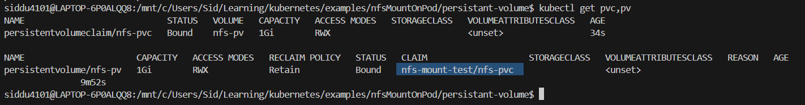
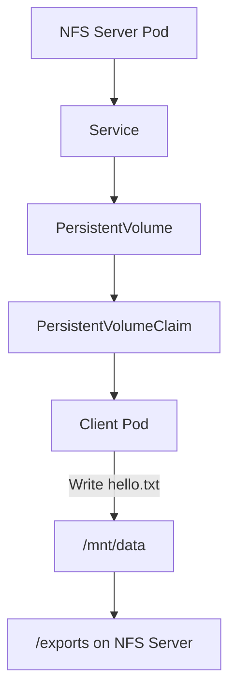
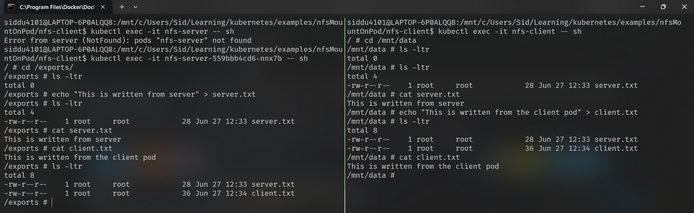

# 📦 Kubernetes NFS Persistent Volume Demo

> A minimal, end-to-end example of using an **NFS Server running inside Kubernetes** as a backend for a **PersistentVolume (PV)** and **PersistentVolumeClaim (PVC)**.

---

## 🎯 Goal

Understand the complete Kubernetes storage flow by manually creating:

```text
NFS Server Pod
      │
      ▼
Service
      │
      ▼
PersistentVolume (PV)
      │
      ▼
PersistentVolumeClaim (PVC)
      │
      ▼
Client Pod
```

No dynamic provisioning, no CSI drivers—just the core Kubernetes concepts.

---

# 🚀 Step 0 - Create Namespace

All resources in this demo live in a dedicated namespace.

```bash
kubectl create ns nfs-mount-test
```

---

# 🚀 Step 1 - Deploy NFS Server

The NFS server runs inside a Kubernetes Pod.

It exports a directory:

```text
/exports
```

Deployment uses:

- ✅ Privileged container (`securityContext.privileged: true`)
- ✅ `emptyDir` as backend storage
- ✅ Environment variable `SHARED_DIRECTORY` pointing to `/exports`

```yaml
apiVersion: apps/v1
kind: Deployment
metadata:
  name: nfs-server
  namespace: nfs-mount-test
spec:
  replicas: 1
  selector:
    matchLabels:
      app: nfs-server
  template:
    metadata:
      labels:
        app: nfs-server
    spec:
      containers:
      - name: nfs-server
        image: itsthenetwork/nfs-server-alpine:latest
        securityContext:
          privileged: true
        env:
        - name: SHARED_DIRECTORY  # directory exported over NFS
          value: /exports
        volumeMounts:
        - name: nfs-data
          mountPath: /exports
      volumes:
      - name: nfs-data
        emptyDir: {}  # demo only – data lives only as long as the Pod
```

- `SHARED_DIRECTORY` tells the NFS server image which directory to export.
- `privileged: true` is required so the container can load kernel NFS modules.
- `emptyDir` is used as the backing store for this demo.

```bash
kubectl apply -f nfs-server.yml
```

---

# 🚀 Step 2 - Expose using a Service

A ClusterIP Service gives the server a stable network identity instead of relying on the ephemeral Pod IP.

```yaml
apiVersion: v1
kind: Service
metadata:
  name: nfs-service
spec:
  selector:
    app: nfs-server  # matches the label on the NFS server Pod
  ports:
    - name: nfs
      port: 2049       # standard NFS port
      targetPort: 2049
```

- The selector `app: nfs-server` ties this Service to the Deployment above.
- Port `2049` is the standard NFS port.
- The assigned **ClusterIP** is used as `nfs.server` in the PersistentVolume.

```bash
kubectl apply -f nfs-service.yml
```


---

# 🚀 Step 3 - Create a PersistentVolume

The PV tells Kubernetes:

> "Storage exists at this NFS server."

```yaml
apiVersion: v1
kind: PersistentVolume
metadata:
  name: nfs-pv
spec:
  capacity:
    storage: 1Gi

  accessModes:
    - ReadWriteMany  # required for NFS – allows multiple Pods to read/write simultaneously

  persistentVolumeReclaimPolicy: Retain  # data is preserved when the PVC is deleted

  storageClassName: ""  # disables dynamic provisioning; PV is matched manually

  nfs:
    server: 10.110.235.81  # ClusterIP of nfs-service (kubectl get svc nfs-service)
    path: /               # NFSv4 pseudo-root – see the NFSv4 behaviour note below
```

- **`accessModes: ReadWriteMany`** — required for NFS.
- **`persistentVolumeReclaimPolicy: Retain`** — preserves data after the PVC is released.
- **`storageClassName: ""`** — prevents the default StorageClass from intercepting this PV.
- **`nfs.path: /`** — because the server uses `fsid=0`, `/exports` becomes the NFSv4 pseudo-root; the client must mount `/` (see the NFSv4 behaviour section).

```bash
kubectl apply -f persistant-volume.yml
```

---

# 🚀 Step 4 - Create a PersistentVolumeClaim

The PVC requests storage from Kubernetes.

```yaml
apiVersion: v1
kind: PersistentVolumeClaim
metadata:
  name: nfs-pvc
spec:
  accessModes:
    - ReadWriteMany

  resources:
    requests:
      storage: 1Gi

  storageClassName: ""  # must match the PV's storageClassName for manual binding
```

- **`accessModes`** and **`storageClassName`** must match the PV exactly for binding to succeed.
- **`storageClassName: ""`** — prevents the default StorageClass from intercepting this claim.

```bash
kubectl apply -f persistant-volume-claim.yml
```

> ✅ It automatically binds with the available PV.

Once applied, Kubernetes binds the claim to the matching PV:

```text
PVC ──► PV
```

Status becomes:

```text
Bound
```



---

# 🚀 Step 5 - Mount the PVC

The client Pod mounts the PVC:

```yaml
apiVersion: v1
kind: Pod
metadata:
  name: nfs-client
spec:
  containers:
    - name: client
      image: busybox
      command:
        - sleep
        - "3600"

      volumeMounts:
        - name: shared-storage
          mountPath: /mnt/data  # NFS share appears here inside the container

  volumes:
    - name: shared-storage
      persistentVolumeClaim:
        claimName: nfs-pvc  # references the PVC created in Step 4
```

- **`claimName: nfs-pvc`** — binds this Pod to the NFS-backed storage.
- **`mountPath: /mnt/data`** — the directory where the shared NFS volume appears inside the container.
- The `busybox` image has **no knowledge of NFS** — to the application it is just a regular directory.

```bash
kubectl apply -f nfs-client.yml
```

---

# 🔄 Complete Flow


# ⚠️ Interesting NFSv4 Behavior

Initially the PV used:

```yaml
path: /exports
```

The client failed with:

```text
No such file or directory
```

Changing it to:

```yaml
path: /
```

fixed the problem.

## Why?

The server exports:

```text
/exports *(fsid=0)
```

`fsid=0` makes `/exports` the **NFSv4 pseudo-root**.

Real filesystem:

```text
/
└── exports
    ├── file1
    └── file2
```

Client view:

```text
/
├── file1
└── file2
```

So from the client's perspective:

```yaml
path: /
```

already points to the server's `/exports`.

---

# 📌 Key Learnings

- Pods should consume **PVCs**, never PVs.
- PVs represent storage.
- PVCs request storage.
- Services provide stable networking.
- CoreDNS resolves Service names.
- The kubelet mounts network storage before the Pod starts.
- NFSv4 with `fsid=0` exposes a **pseudo-root**, so the client mounts `/`.

---

# 🎉 Result

Successfully built the complete Kubernetes storage pipeline:



The server has NFS path as /exports
and the client has at /mnt/data/ 
when we write to one it will reflect in both

Writing a file from the client Pod immediately appears inside the NFS server's exported directory, proving the entire storage stack works correctly.


